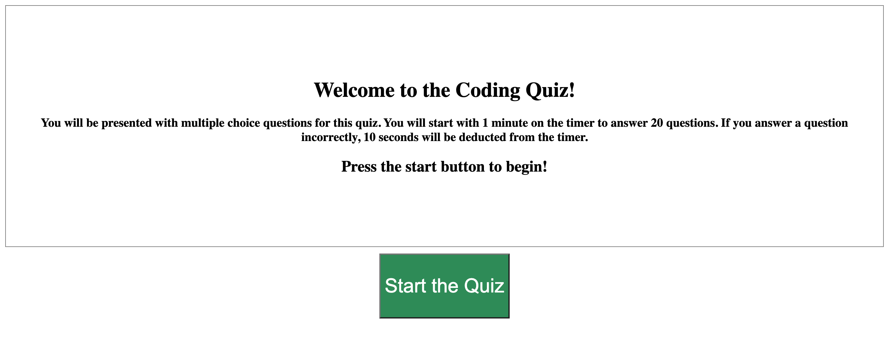
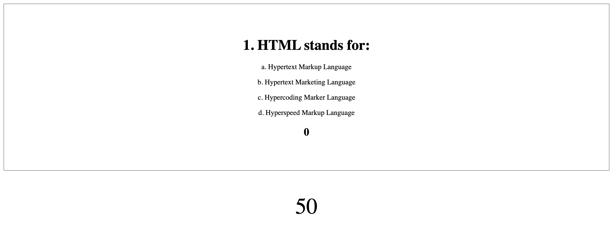
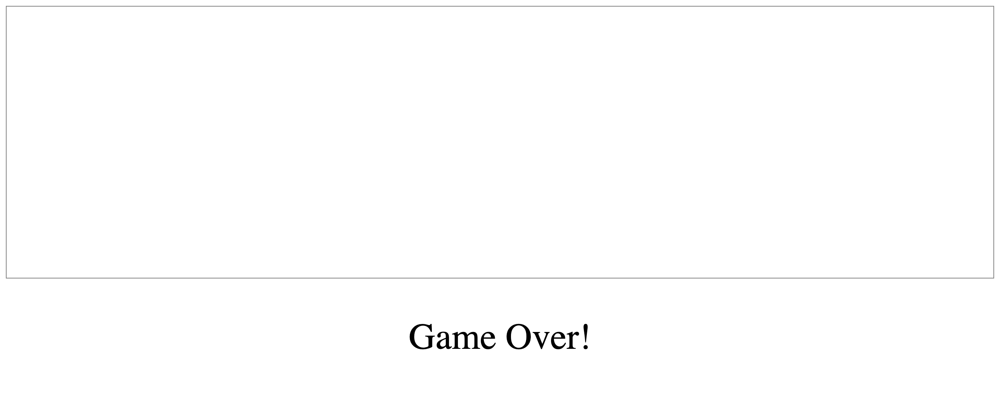

# Coding-Quiz
This project was to create a timed quiz using javascript logic. The user has one minute to answer up to 20 multiple choice questions. If the user answers the question incorrectly, 10 seconds is deducted from the timer. 

https://shannonquinn91.github.io/Coding-Quiz/

I started all the code from scratch and started by creating an index HTML, a style sheet, and a javascript file. 

I wrote questions for my quiz and stored them in an array of objects. Each object contains a question, options, and correct answer number. The correct answer refers to the index of the options array which contains the correct answer to the question. 

I set the HTML up in an overall container and then declared a welcome div, a quiz content div, a button div, and a timer div. 

In the javascript, I started by setting up a couple of functions that would clear the welcome screen and the start button. I also defined a function to render the quiz questions and choices by grabbing elements from the HTML to show the question and choices based on the current index. Then I applied a click listener to the start button and inserted the functions in there. 

Next I used click events to each potential answer. If the index of the answer was equal to the correctAnswer property of the object at the current index, the "Correct" text would show. Otherwise, "Wrong Answer" displays and 10 seconds are taken off the timer. 

This assignment was particularly challenging for me based on what we were learning in class this week. I am really struggling with the score element and the high scores part. I am continually working on it to try to add more functionality (and style). 

